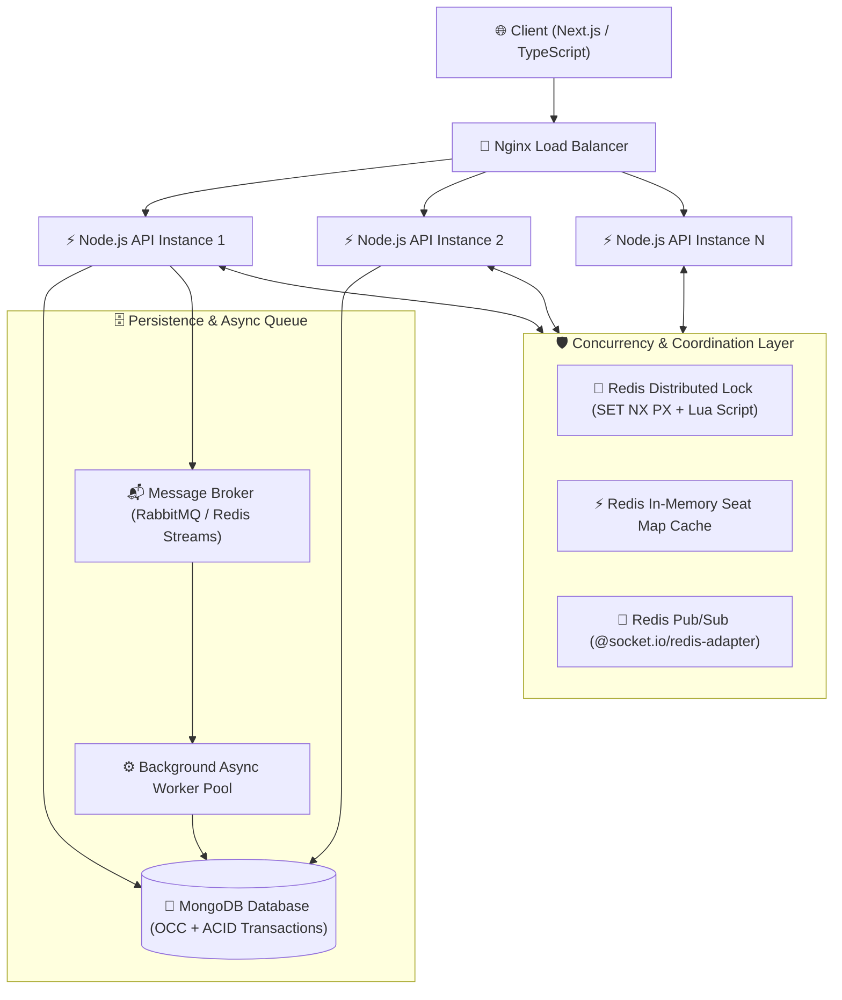

<div align="center">

# 🎟️ TICKET FLOW
### Scalable Real-Time Event Ticket Booking System

[](https://nodejs.org/)
[](https://nextjs.org/)
[](https://www.typescriptlang.org/)
[](https://redis.io/)
[](https://www.mongodb.com/)
[](https://socket.io/)
[](https://www.docker.com/)
[](LICENSE)

<p align="center">
  <b>A high-throughput, distributed event ticketing platform engineered to eliminate race conditions, prevent seat double-booking, and maintain low-latency responsiveness during massive flash-crowd sales.</b>
</p>

[📚 Full Documentation Index](docs/README.md) •
[📋 SRS Specification](docs/srs/SRS.md) •
[🏗️ System Architecture](docs/architecture/system-architecture.md) •
[📊 UML Diagrams](docs/uml/uml-diagrams.md) •
[🗄️ Database Design](docs/database/database-design.md) •
[🚀 Local Setup](docs/development/local-development.md)

</div>

---

## 📌 Academic Project Profile

- **Program:** Bachelor of Technology (B.Tech) in Computer Science & Engineering
- **Academic Session:** 2026–2027
- **Institution:** Integral University, Lucknow
- **Project Supervisor:** Mohd. Anas Khan
- **Project Team:**
  - **Pranav Dembla** (Roll No: `2300100925` / `2301888021`)
  - **Sachin Gautam** (Roll No: `2300101889` / `2301888023`)

---

## ⚡ The Problem: Flash-Crowd Concurrency

During high-demand ticket sales (e.g., Coldplay concerts, sports tournaments, college fests), tens of thousands of users attempt to purchase identical, limited seats at the exact same second.

Conventional three-tier web applications suffer from:
1. **"Check-Then-Act" Race Conditions:** Multiple worker threads read seat availability before any write finishes, confirming multiple users for the identical physical seat (**Double-Booking**).
2. **Database Contention & Lock Exhaustion:** Direct read/write traffic floods database connection pools, crashing backend services.
3. **Synchronous Request Bottlenecks:** Blocking operations (payment verification, invoice rendering, email dispatch) cause cascading timeouts (HTTP 504).

---

## 🛡️ The Solution: Multi-Layered Defense-in-Depth

Ticket Flow solves this through a high-performance, distributed, multi-tiered architecture:



### 4-Stage Concurrency Guard
1. **Layer 1 (In-Memory Guard):** Atomic Redis Distributed Lock (`SET NX PX`) absorbs 99% of collision traffic in RAM with $<1\text{ ms}$ latency.
2. **Layer 2 (Database Guard):** MongoDB Optimistic Concurrency Control (OCC) with version matching acts as the immutable ground-truth barrier.
3. **Layer 3 (Storage Engine Integrity):** Compound unique index `{ eventId: 1, section: 1, row: 1, number: 1 }` prevents duplicate physical allocations.
4. **Layer 4 (Settlement Atomicity):** Multi-Document ACID Transactions commit `Booking` + `Payment` + `Seat` state atomically.

---

## 🧭 Project Roadmap & Semester Breakdown

```
Semester VII (Current): Concurrency Engine & Baseline  ──►  Semester VIII: Real-Time Scaling & Queues
├─ Requirements & Architecture Specification                ├─ WebSocket Live Seat Map (Socket.io)
├─ MongoDB Schemas & Unique Indexing                        ├─ Multi-Tier Redis Caching Strategy
├─ Concurrency Engine (OCC vs. Redis Locking)               ├─ Virtual Waiting Room (FIFO Traffic Shaper)
└─ k6 / Artillery Collision Benchmarking                    └─ Horizontally Scaled Multi-Container Cluster
```

| Phase | Core Deliverables | Key Technologies |
| :--- | :--- | :--- |
| **Semester VII** | • Requirement analysis & IEEE-style SRS<br>• System architecture, UML & ER diagrams<br>• Base booking API & seat locking engine<br>• OCC vs. Redis Distributed Lock comparison & k6 benchmarks | Next.js, Node.js, Express, MongoDB, Redis, Jest, k6 |
| **Semester VIII** | • Real-time live seat updates broadcasting<br>• Multi-node Redis Pub/Sub sync<br>• Virtual Waiting Room (traffic shaping queue)<br>• Async background workers & invoice generation<br>• Horizontally scaled Docker cluster behind Nginx | Socket.io, Redis Adapter, RabbitMQ / Redis Streams, Docker, Docker Compose, Nginx |

---

## 📂 Documentation Library

Explore the complete technical and academic design documentation in the [`docs/`](docs/) directory:

| Document | Description | Direct Link |
| :--- | :--- | :--- |
| **Master Index** | Overview, semester matrix, and document navigation | [📖 docs/README.md](docs/README.md) |
| **SRS Specification** | Functional & non-functional requirements with testable IDs | [📋 docs/srs/SRS.md](docs/srs/SRS.md) |
| **Problem & Research Gap** | Formal problem analysis, 5 Research Questions (RQ1–RQ5) | [🔬 docs/research/research-gap.md](docs/research/research-gap.md) |
| **Literature Review** | 14 thematic research notes & paper publication outline | [📚 docs/research/literature-review.md](docs/research/literature-review.md) |
| **System Architecture** | Multi-tier topology, data flows, and design decisions | [🏗️ docs/architecture/system-architecture.md](docs/architecture/system-architecture.md) |
| **UML Diagrams** | Use Case, Class, Concurrency Sequence, & Activity models | [📊 docs/uml/uml-diagrams.md](docs/uml/uml-diagrams.md) |
| **Database Design** | Logical ERD, 10 collection schemas, indexes & OCC strategy | [🗄️ docs/database/database-design.md](docs/database/database-design.md) |
| **Technology Evaluation** | Tech stack selection matrix and responsibility mapping | [⚙️ docs/development/setup.md](docs/development/setup.md) |
| **Local Development Guide** | Step-by-step setup, Docker commands & load testing scripts | [🚀 docs/development/local-development.md](docs/development/local-development.md) |

---

## 🚀 Quick Start (Local Development)

### 1. Prerequisites
- [Node.js v20+](https://nodejs.org/)
- [Docker & Docker Compose](https://www.docker.com/)
- [Git](https://git-scm.com/)

### 2. Clone & Spin up Infrastructure
```bash
# Clone the repository
git clone https://github.com/CHACHA0044/Ticket-flow.git
cd Ticket-flow

# Launch MongoDB, Redis, and RabbitMQ via Docker
docker-compose -f docker/docker-compose.yml up -d mongo redis
```

### 3. Start Backend & Seed Data
```bash
cd server
npm install
npm run seed     # Generates sample venues, events, and 200 seats
npm run dev      # Runs Express server at http://localhost:5000
```

### 4. Start Next.js Frontend
```bash
cd ../client
npm install
npm run dev      # Runs Next.js web application at http://localhost:3000
```

---

## 🧪 Concurrency Collision Load Testing

To simulate $500+$ concurrent users competing for the identical seat at $t = 0$:

```bash
# Run automated k6 collision benchmark
k6 run tests/load/concurrency-benchmark.js
```

**Expected Outcome:** Exactly 1 reservation succeeds (`201 Created`), all 499 competing requests receive clean conflict rejections (`409 Conflict`), and zero double-bookings occur.

---

## 👥 Contributors

- **Pranav Dembla** — B.Tech CSE, Integral University (Roll No: 2300100925 / 2301888021)
- **Sachin Gautam** — B.Tech CSE, Integral University (Roll No: 2300101889 / 2301888023)
- **Supervised by:** Mohd. Anas Khan, Department of Computer Science & Engineering, Integral University, Lucknow

---

## 📄 License
This project is developed for academic evaluation under the Bachelor of Technology curriculum (2026–2027) and is licensed under the [MIT License](LICENSE).
