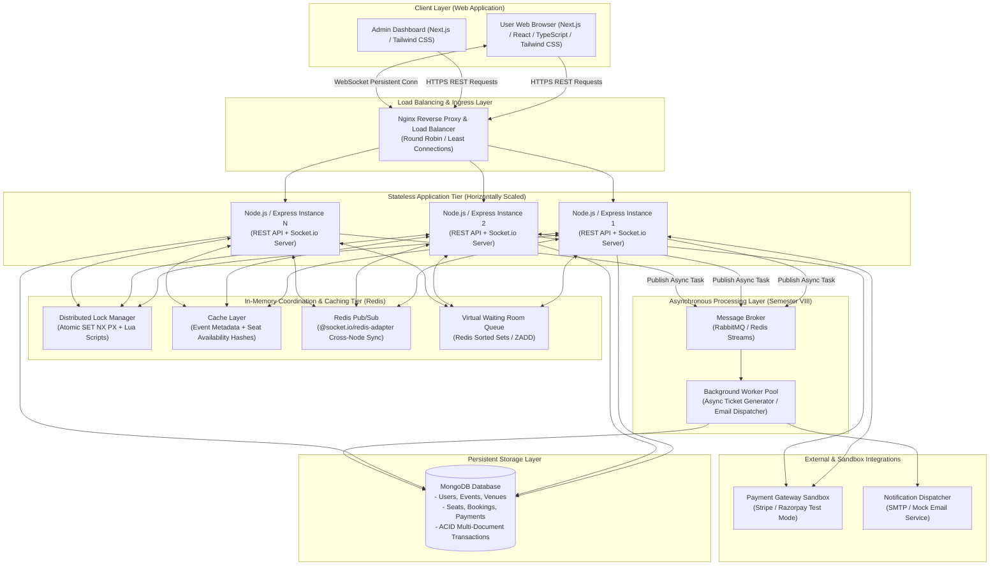
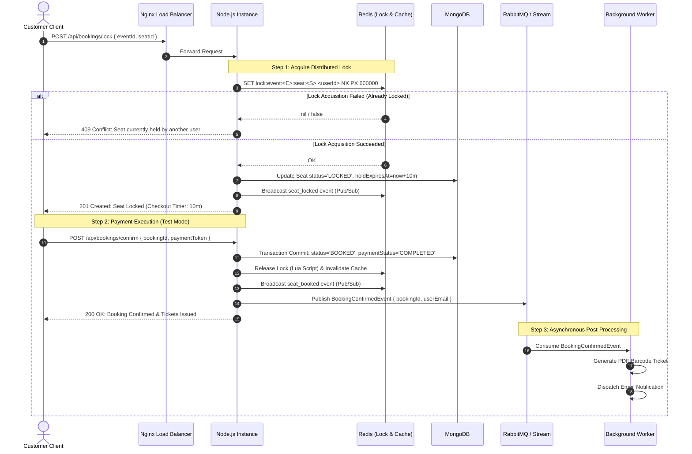

# System Architecture Specification
## Ticket Flow — Scalable Real-Time Event Ticket Booking System

**Project Authors:** Pranav Dembla (2300100925 / 2301888021), Sachin Gautam (2300101889 / 2301888023)  
**Supervisor:** Mohd. Anas Khan  
**Department:** Computer Science & Engineering, Integral University, Lucknow  
**Academic Year:** 2026–2027  

---

## 1. High-Level Architecture Overview

Ticket Flow is architected as a decoupled, multi-tier distributed system designed for high availability, fault tolerance, and sub-millisecond atomic concurrency control under flash-crowd conditions.

---

## 2. Semester Scope Breakdown

### 2.1 Semester VII Architecture (Core Concurrency & Baseline Engine)
The Semester VII implementation is focused on solving and evaluating the concurrency challenge:
- **Client Tier:** Initial Next.js client for user authentication, event browsing, and seat booking.
- **Application Tier:** Single to dual Node.js/Express instance executing REST endpoints.
- **Persistence Tier:** MongoDB schema holding users, events, seats, and bookings with single-document atomicity and indexing.
- **Concurrency Tier:** 
  - **Mechanism A (Baseline):** Database-level Optimistic Concurrency Control (OCC) using versioned fields and conditional MongoDB update queries.
  - **Mechanism B (Proposed):** Redis Distributed Locking using atomic `SET NX PX` and Lua-script release mechanisms.
- **Benchmarking Suite:** Automated k6 / Artillery scripts generating high-concurrency seat collision workloads to compare OCC vs. Redis Locking.

### 2.2 Semester VIII Architecture (Scalability, Real-Time & Traffic Shaping)
The Semester VIII implementation builds upon the verified concurrency core:
- **WebSocket Synchronization:** Integration of Socket.io and `@socket.io/redis-adapter` for broadcasting live seat map status across horizontally scaled nodes.
- **Multi-Tier Caching:** Redis caching for event catalog and seat state bitfields/hashes, reducing read load on MongoDB by up to 90%.
- **Virtual Waiting Room:** Fair FIFO rate-limiting queue using Redis Sorted Sets to manage flash crowds before entering the seat-selection flow.
- **Asynchronous Task Workers:** Decoupled background processing using RabbitMQ / Redis Streams for non-blocking invoice creation, email notifications, and analytics.
- **Multi-Container Cluster:** Production-grade Docker Compose architecture with Nginx load balancing and stress testing.

---

## 3. Detailed Component Interaction & Data Flow

---

## 4. Key Architectural Design Decisions

| ID | Decision Item | Selected Approach | Rationale & Trade-off Analysis |
| :--- | :--- | :--- | :--- |
| **AD-01** | **Primary Database** | **MongoDB (Document Store)** | Flexible hierarchical schema for complex venue/seat topologies; fast single-document atomic updates; ACID multi-document transactions support for checkout commits. |
| **AD-02** | **In-Memory Store** | **Redis v7.2** | Single-threaded in-memory engine provides sub-millisecond atomic primitives (`SET NX PX`, Lua scripting, Sorted Sets) ideal for distributed locks, caching, and WebSocket adapter coordination. |
| **AD-03** | **Application Framework** | **Node.js + Express** | Non-blocking, event-driven asynchronous I/O model handles thousands of concurrent I/O connections efficiently with lightweight memory footprints. |
| **AD-04** | **Real-Time Transport** | **Socket.io + Redis Adapter** | Robust fallback mechanisms (WebSockets with HTTP long-polling fallback), room-based abstractions, and native multi-instance pub/sub distribution via Redis. |
| **AD-05** | **Decoupled Task Queue** | **RabbitMQ / Redis Streams** | Ensures zero user latency impact for post-booking side-effects (ticket generation, email receipts, analytical indexing) while ensuring at-least-once processing delivery. |
| **AD-06** | **Containerization & Ingress** | **Docker Compose + Nginx** | Fully reproducible local orchestration simulating real-world production topology with layer-7 load balancing and static asset acceleration. |
