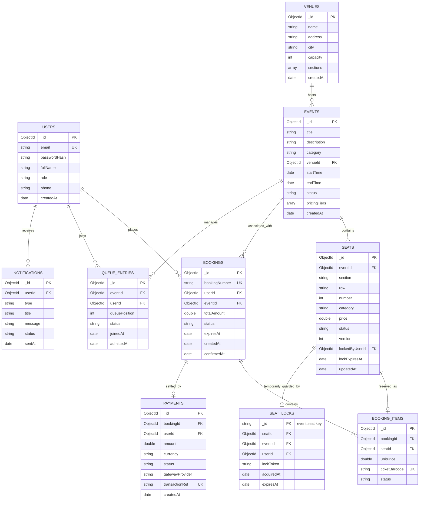

# 🗄️ Database Design & Schema Specification
## Ticket Flow — Scalable Real-Time Event Ticket Booking System

> [!NOTE]  
> **Academic Session:** 2026–2027 • **Degree:** B.Tech Computer Science & Engineering  
> **Institution:** Integral University, Lucknow • **Supervisor:** Mohd. Anas Khan  
> **Authors:** Pranav Dembla (2300100925 / 2301888021), Sachin Gautam (2300101889 / 2301888023)  

---

## 1. Entity-Relationship (ER) Diagram

Although MongoDB is a document-oriented database, the domain model maintains well-defined logical entities and relational integrity constraints across the event lifecycle.



---

## 2. MongoDB Collections & Detailed Schemas

### 2.1 Collection: `users`
- **Purpose:** Stores user profiles, credentials, and access roles.

| Field Name | Type | Required | Default | Description / Constraints |
| :--- | :--- | :---: | :---: | :--- |
| `_id` | `ObjectId` | Yes | Auto | Unique MongoDB Identifier |
| `email` | `String` | Yes | - | Unique email index, lowercase, trimmed |
| `passwordHash` | `String` | Yes | - | Salted bcrypt hash ($workFactor \ge 10$) |
| `fullName` | `String` | Yes | - | Full name of the user |
| `role` | `String` | Yes | `'CUSTOMER'` | Enum: `['CUSTOMER', 'ADMIN']` |
| `phone` | `String` | No | `null` | E.164 formatted telephone number |
| `createdAt` | `Date` | Yes | `Date.now` | Account creation timestamp |
| `updatedAt` | `Date` | Yes | `Date.now` | Record modification timestamp |

**Indexes:**
- `{ email: 1 }` (Unique Index)

---

### 2.2 Collection: `venues`
- **Purpose:** Represents physical or virtual event arenas and seating configurations.

| Field Name | Type | Required | Default | Description / Constraints |
| :--- | :--- | :---: | :---: | :--- |
| `_id` | `ObjectId` | Yes | Auto | Venue Identifier |
| `name` | `String` | Yes | - | Arena/Stadium/Hall name |
| `address` | `String` | Yes | - | Street address |
| `city` | `String` | Yes | - | City name |
| `capacity` | `Number` | Yes | - | Total seat capacity ($>0$) |
| `sections` | `Array` | Yes | `[]` | Array of section layouts (VIP, Balcony, Ground) |
| `createdAt` | `Date` | Yes | `Date.now` | Creation timestamp |

**Indexes:**
- `{ city: 1, name: 1 }`

---

### 2.3 Collection: `events`
- **Purpose:** Holds event schedules, metadata, venue linkage, and booking phase status.

| Field Name | Type | Required | Default | Description / Constraints |
| :--- | :--- | :---: | :---: | :--- |
| `_id` | `ObjectId` | Yes | Auto | Event Identifier |
| `title` | `String` | Yes | - | Event title |
| `description` | `String` | Yes | - | Markdown / Plain text overview |
| `category` | `String` | Yes | - | Enum: `['CONCERT', 'SPORTS', 'CONFERENCE', 'THEATRE']` |
| `venueId` | `ObjectId` | Yes | - | Reference $\to$ `venues._id` |
| `startTime` | `Date` | Yes | - | Event commencement timestamp |
| `endTime` | `Date` | Yes | - | Event termination timestamp |
| `status` | `String` | Yes | `'DRAFT'` | Enum: `['DRAFT', 'PUBLISHED', 'OPEN', 'CLOSED', 'CANCELLED']` |
| `pricingTiers` | `Array` | Yes | `[]` | Array of tier objects `{ tierName, price, currency }` |
| `createdAt` | `Date` | Yes | `Date.now` | Creation timestamp |

**Indexes:**
- `{ status: 1, startTime: 1 }` (Public catalog filtering)
- `{ venueId: 1 }`

---

### 2.4 Collection: `seats` (Critical Concurrency Entity)

> [!IMPORTANT]  
> The `seats` collection serves as the primary ground truth for seat state. Every update uses atomic conditions and Optimistic Concurrency Control (`version` integer) to prevent lost updates.

| Field Name | Type | Required | Default | Description / Constraints |
| :--- | :--- | :---: | :---: | :--- |
| `_id` | `ObjectId` | Yes | Auto | Seat Identifier |
| `eventId` | `ObjectId` | Yes | - | Reference $\to$ `events._id` |
| `section` | `String` | Yes | - | E.g., `'Section A'`, `'VIP Front'` |
| `row` | `String` | Yes | - | E.g., `'Row 1'`, `'Row K'` |
| `number` | `Number` | Yes | - | Seat number within row |
| `category` | `String` | Yes | `'GENERAL'` | Pricing tier identifier |
| `price` | `Number` | Yes | - | Price in base currency units |
| `status` | `String` | Yes | `'AVAILABLE'` | Enum: `['AVAILABLE', 'LOCKED', 'BOOKED', 'BLOCKED']` |
| `version` | `Number` | Yes | `1` | Optimistic Concurrency Control integer counter |
| `lockedByUserId` | `ObjectId` | No | `null` | User currently holding the lock |
| `lockExpiresAt` | `Date` | No | `null` | Hold expiration timestamp (TTL) |
| `updatedAt` | `Date` | Yes | `Date.now` | Last state transition timestamp |

**Indexes:**
- `{ eventId: 1, section: 1, row: 1, number: 1 }` (Unique Compound Index)
- `{ eventId: 1, status: 1 }` (Fast query index for available seat maps)
- `{ lockExpiresAt: 1 }` (Partial/TTL index for sweeping expired holds)

---

### 2.5 Collection: `bookings`
- **Purpose:** Master transaction record for a user's purchase session.

| Field Name | Type | Required | Default | Description / Constraints |
| :--- | :--- | :---: | :---: | :--- |
| `_id` | `ObjectId` | Yes | Auto | Booking Identifier |
| `bookingNumber`| `String` | Yes | Auto | Unique human-readable code (e.g., `TF-2026-89712`) |
| `userId` | `ObjectId` | Yes | - | Reference $\to$ `users._id` |
| `eventId` | `ObjectId` | Yes | - | Reference $\to$ `events._id` |
| `totalAmount` | `Number` | Yes | - | Total invoice amount |
| `currency` | `String` | Yes | `'INR'` | ISO 4217 Currency Code |
| `status` | `String` | Yes | `'PENDING'` | Enum: `['PENDING', 'CONFIRMED', 'CANCELLED', 'EXPIRED']` |
| `expiresAt` | `Date` | Yes | - | Checkout deadline |
| `confirmedAt` | `Date` | No | `null` | Payment confirmation timestamp |
| `createdAt` | `Date` | Yes | `Date.now` | Reservation creation timestamp |

**Indexes:**
- `{ bookingNumber: 1 }` (Unique Index)
- `{ userId: 1, createdAt: -1 }` (User booking history queries)
- `{ eventId: 1, status: 1 }` (Event revenue reconciliation)

---

### 2.6 Collection: `bookingItems`
- **Purpose:** Line-item tickets associated with a booking, linking directly to physical seats.

| Field Name | Type | Required | Default | Description / Constraints |
| :--- | :--- | :---: | :---: | :--- |
| `_id` | `ObjectId` | Yes | Auto | Item Identifier |
| `bookingId` | `ObjectId` | Yes | - | Reference $\to$ `bookings._id` |
| `seatId` | `ObjectId` | Yes | - | Reference $\to$ `seats._id` |
| `unitPrice` | `Number` | Yes | - | Price charged for this specific seat |
| `ticketBarcode`| `String` | Yes | Auto | Unique verifiable token/hash for gate scanning |
| `status` | `String` | Yes | `'ACTIVE'` | Enum: `['ACTIVE', 'VOIDED', 'USED']` |

**Indexes:**
- `{ bookingId: 1 }`
- `{ seatId: 1 }`
- `{ ticketBarcode: 1 }` (Unique Index)

---

### 2.7 Collection: `seatLocks` (Audit & Fallback Store)
- **Purpose:** Auxiliary audit tracking of temporary distributed lock allocations.

| Field Name | Type | Required | Default | Description / Constraints |
| :--- | :--- | :---: | :---: | :--- |
| `_id` | `String` | Yes | - | Unique lock key (e.g., `lock:eventId:seatId`) |
| `seatId` | `ObjectId` | Yes | - | Reference $\to$ `seats._id` |
| `eventId` | `ObjectId` | Yes | - | Reference $\to$ `events._id` |
| `userId` | `ObjectId` | Yes | - | Reference $\to$ `users._id` |
| `lockToken` | `String` | Yes | - | Random UUID token for verification on release |
| `expiresAt` | `Date` | Yes | - | TTL timestamp |

**Indexes:**
- `{ expiresAt: 1 }` (TTL index with `expireAfterSeconds: 0`)

---

### 2.8 Collection: `payments`
- **Purpose:** Records payment gateway transaction results and test sandbox payloads.

| Field Name | Type | Required | Default | Description / Constraints |
| :--- | :--- | :---: | :---: | :--- |
| `_id` | `ObjectId` | Yes | Auto | Payment Identifier |
| `bookingId` | `ObjectId` | Yes | - | Reference $\to$ `bookings._id` |
| `userId` | `ObjectId` | Yes | - | Reference $\to$ `users._id` |
| `amount` | `Number` | Yes | - | Settlement amount |
| `currency` | `String` | Yes | `'INR'` | Currency code |
| `status` | `String` | Yes | `'INITIATED'` | Enum: `['INITIATED', 'SUCCESS', 'FAILED', 'REFUNDED']` |
| `gatewayProvider`| `String` | Yes | `'STRIPE_TEST'`| Enum: `['STRIPE_TEST', 'RAZORPAY_TEST']` |
| `transactionRef`| `String` | Yes | - | Unique gateway payment intent / charge ID |
| `createdAt` | `Date` | Yes | `Date.now` | Payment attempt timestamp |

**Indexes:**
- `{ bookingId: 1 }`
- `{ transactionRef: 1 }` (Unique Index)

---

### 2.9 Collection: `queueEntries` (Semester VIII Virtual Waiting Room)
- **Purpose:** Tracks user positions in the virtual waiting-room queue for flash events.

| Field Name | Type | Required | Default | Description / Constraints |
| :--- | :--- | :---: | :---: | :--- |
| `_id` | `ObjectId` | Yes | Auto | Queue Entry Identifier |
| `eventId` | `ObjectId` | Yes | - | Reference $\to$ `events._id` |
| `userId` | `ObjectId` | Yes | - | Reference $\to$ `users._id` |
| `priorityScore`| `Number` | Yes | - | Epoch millisecond timestamp for FIFO ordering |
| `status` | `String` | Yes | `'WAITING'` | Enum: `['WAITING', 'ADMITTED', 'EXPIRED']` |
| `admissionToken`| `String` | No | `null` | JWT token granted upon admission |
| `admittedAt` | `Date` | No | `null` | Timestamp when user entered seat selection |
| `joinedAt` | `Date` | Yes | `Date.now` | Queue entry timestamp |

**Indexes:**
- `{ eventId: 1, status: 1, priorityScore: 1 }` (Compound FIFO Index)
- `{ userId: 1, eventId: 1 }` (Unique Index per active event)

---

### 2.10 Collection: `notifications`
- **Purpose:** Audit log of asynchronous notification dispatches.

| Field Name | Type | Required | Default | Description / Constraints |
| :--- | :--- | :---: | :---: | :--- |
| `_id` | `ObjectId` | Yes | Auto | Notification Identifier |
| `userId` | `ObjectId` | Yes | - | Reference $\to$ `users._id` |
| `type` | `String` | Yes | `'EMAIL'` | Enum: `['EMAIL', 'SMS', 'IN_APP']` |
| `title` | `String` | Yes | - | Message subject |
| `message` | `String` | Yes | - | Message body payload |
| `status` | `String` | Yes | `'QUEUED'` | Enum: `['QUEUED', 'SENT', 'FAILED']` |
| `sentAt` | `Date` | No | `null` | Dispatch timestamp |

---

## 3. Concurrency Protection Strategy: Defense-in-Depth

> [!TIP]  
> The persistence architecture employs a **4-Tier Defense-in-Depth model** to guarantee zero double-booking under extreme concurrency ($>1,000\text{ RPS}$ per seat).

```
Layer 1: Redis Fast In-Memory Lock (Sub-millisecond gatekeeper)
   ↓ (Filters out 99% of collision traffic in RAM in <1ms)
Layer 2: MongoDB Single-Document Atomic Condition (OCC with version check)
   ↓ (Guarantees database consistency even if Redis lock expired prematurely)
Layer 3: MongoDB Compound Unique Index constraint
   ↓ (Guarantees physical seat integrity at the storage engine level)
Layer 4: Multi-Document ACID Transaction
   ↓ (Atomically links Booking + Payment + Seats in a single commit)
```

### 3.1 Why Neither Layer Alone Is Sufficient
1. **Redis Alone:** In the event of network partition, client pause, or unexpected Redis failover without sync, Redis key state could be cleared. Without database validation, double-booking would occur.
2. **MongoDB OCC Alone:** Under 2,000 concurrent requests for 1 seat, 1,999 database transactions would execute, hit database locks, and abort, causing severe database CPU exhaustion and connection pool starvation.
3. **Synergy:** Redis absorbs the flash-crowd shockwave in RAM in $<1\text{ ms}$, ensuring only the winning thread executes the write against MongoDB, while MongoDB's atomic version check serves as the immutable ground-truth safety net.
