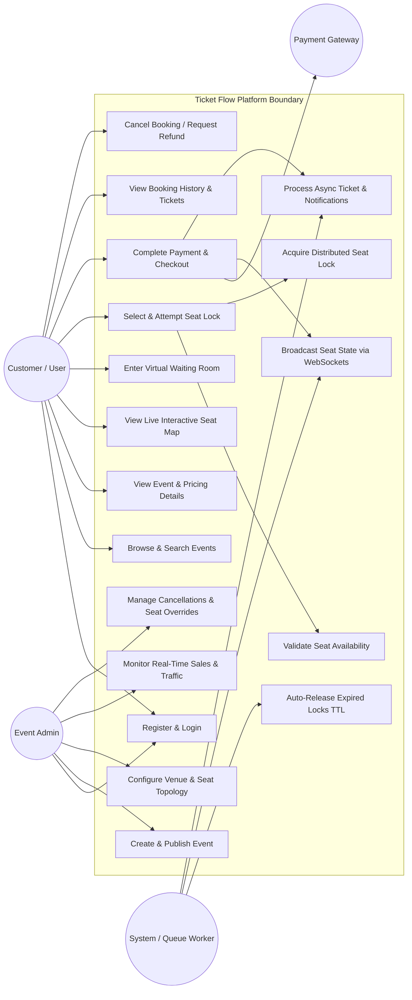
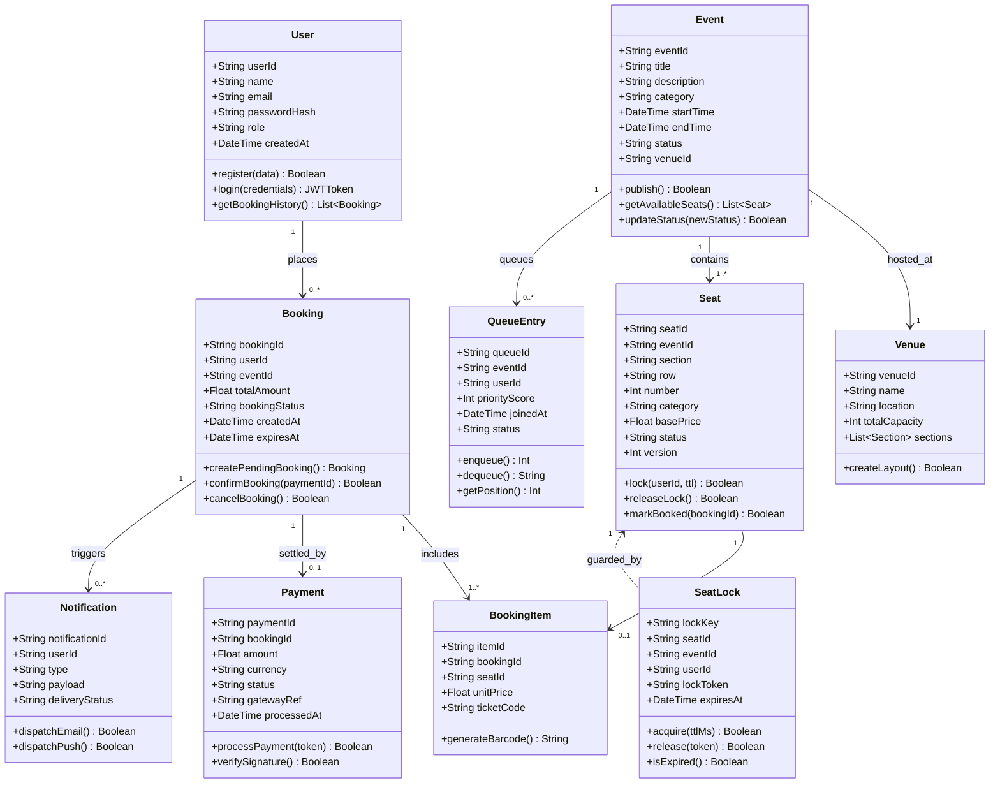
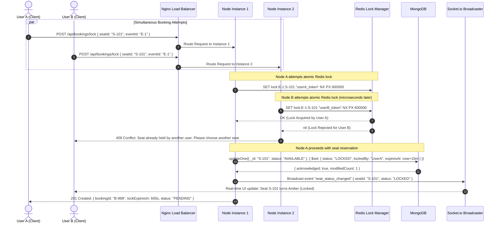
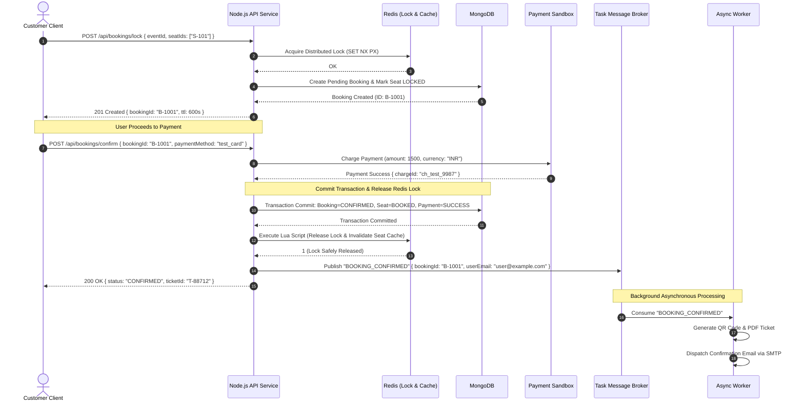
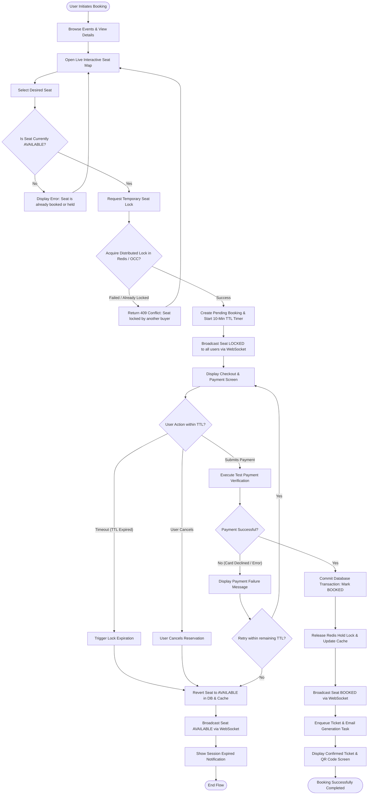

# UML Design Diagrams
## Ticket Flow — Scalable Real-Time Event Ticket Booking System

**Project Authors:** Pranav Dembla (2300100925 / 2301888021), Sachin Gautam (2300101889 / 2301888023)  
**Supervisor:** Mohd. Anas Khan  
**Department:** Computer Science & Engineering, Integral University, Lucknow  
**Academic Year:** 2026–2027  

---

## 1. Use Case Diagram

The Use Case Diagram models the system boundaries, human actors (Customer, Admin), and external systems (Payment Gateway, Notification Worker).

---

## 2. Class Diagram

The Class Diagram defines the object-oriented structure, domain models, entity attributes, methods, and relationships.

---

## 3. Sequence Diagrams

### 3.1 Scenario A: Concurrent Seat Booking (Race Condition Resolution)
*Two users (User A and User B) attempt to lock the exact same physical seat simultaneously.*

---

### 3.2 Scenario B: Normal End-to-End Booking Lifecycle
*From seat selection through payment confirmation, lock release, and asynchronous ticket dispatch.*

---

## 4. Activity Diagram

The Activity Diagram illustrates the complete decision flow, concurrency guards, payment branches, timeout triggers, and system error fallbacks.

